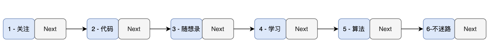
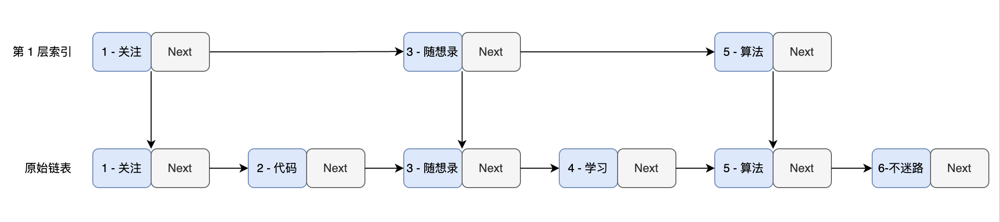
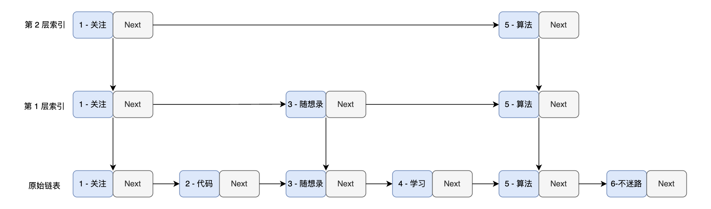
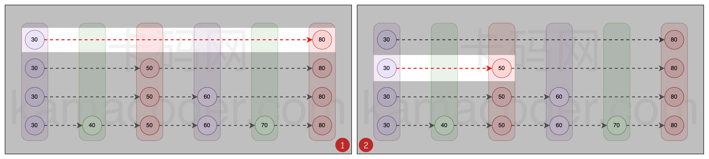
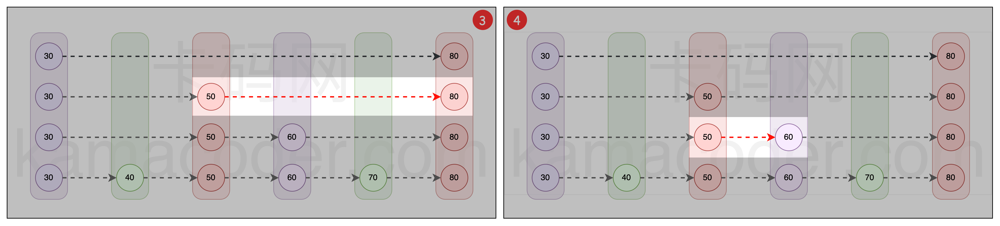
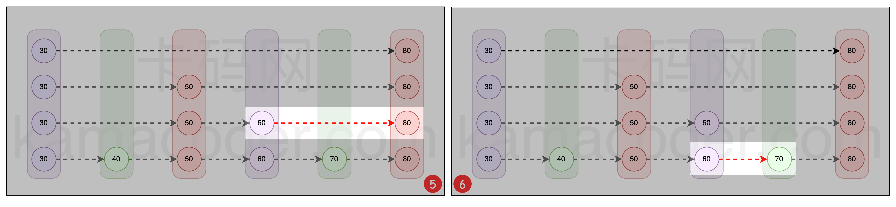
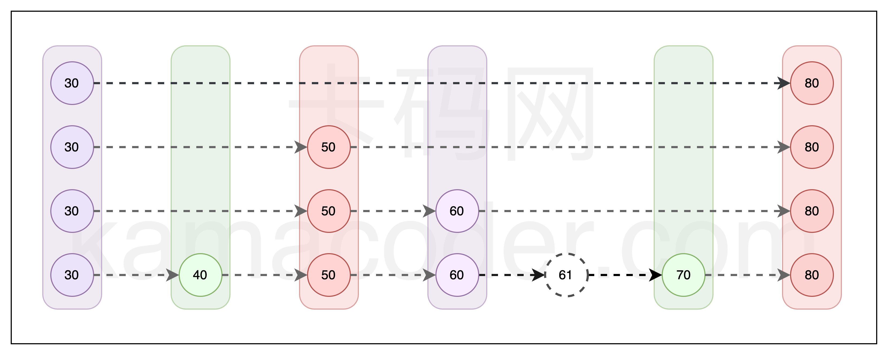
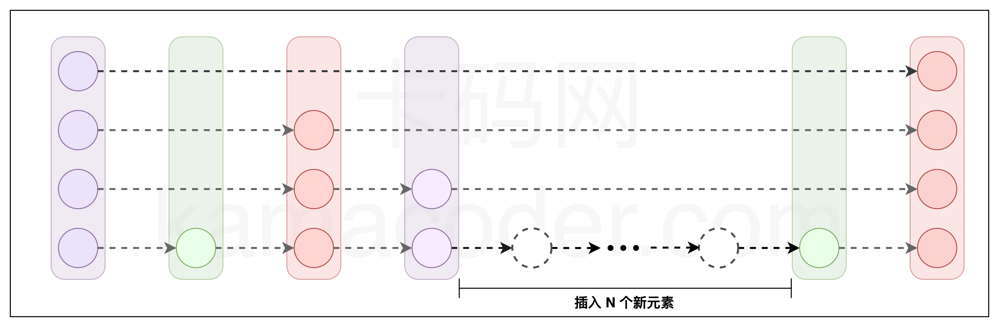
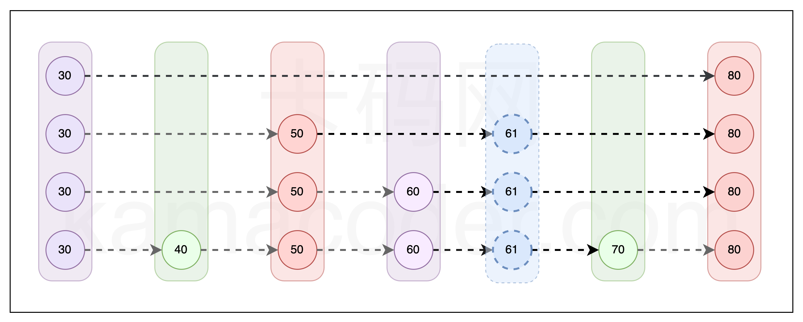
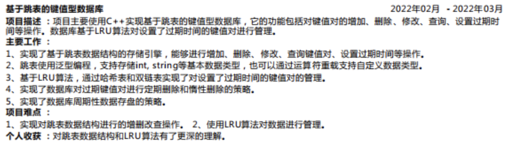

# 项目简介

众所周知，非关系型数据库redis，以及levedb，rockdb其核心存储引擎的数据结构就是跳表。

本项目是**基于跳表实现的轻量级键值型存储引擎**，实现了插入数据、删除数据、查询数据、数据展示、生成持久化文件、恢复数据以及数据库大小显示等功能。

在随机写读情况下，本项目每秒可处理写请求数（QPS）: 24.39w，每秒可处理读请求数（QPS）: 18.41w

## 项目结构

项目整体上拥有一个 `skiplist.h` 文件，包括两个核心类：

- Node 类：存放实际数据。
- SkipList 类：对外提供组织，访问，操作 Node 类的功能。

### 项目中的文件

- main.cpp：include `skiplist.h` 以使用kv存储引擎进行数据操作
- skiplist.h：跳表核心实现
- README.md：中文介绍
- README-en.md：英文介绍
- kv存储引擎.md：项目介绍
- assets：资源文件
- bin：生成可执行文件目录
- makefile：编译脚本
- store：数据落盘的文件存放的文件夹
- stress_test_start.sh：压力测试脚本
- LICENSE：使用协议

### 提供接口

- insertElement（插入数据）
- deleteElement（删除数据）
- searchElement（查询数据）
- displayList（展示已存数据）
- dumpFile（数据落盘）
- loadFile（加载数据）
- size（返回数据规模）

## 实现技术

本项目使用 C++ 开发，除 了 C++ 语法基础外，还使用到以下 C++ 具体核心特性：

- 面向对象
- 类模板
- IO 操作
- 多线程（压测阶段）

## 运行方式

```shell
make            // complie demo main.cpp
./bin/main      // run
```

如果想在其他程序中使用这个kv存储引擎，只需要在其他CPP文件中include `skiplist.h` 就可以了。

可以运行如下脚本测试kv存储引擎的性能（可以根据需求进行修改）

```shell
sh stress_test_start.sh 
```

## 实际应用

- **Redis**：这是最著名的使用跳表的例子。Redis 是一个开源的高性能键值存储数据库，广泛用于缓存和消息队列等场景。在 Redis 中，跳表被用于实现有序集合（sorted sets）数据类型，这主要是因为跳表在处理有序数据时可以提供良好的性能，尤其是在插入、删除和搜索操作上。
- LevelDB：LevelDB 是一个由 Google 开发的快速键值存储库，用于存储非结构化数据。它使用跳表作为其内存中的数据结构，以支持快速的写入操作。跳表在 LevelDB 中帮助实现高效的数据插入和排序。
- RocksDB：RocksDB 是 LevelDB 的一个分支，由 Facebook 进行了大量优化。它同样使用跳表来处理内存中的数据，以优化读写操作的性能。
- Apache HBase：HBase 是一个分布式、可伸缩的大数据存储，基于 Google 的 BigTable 模型。在 HBase 中，跳表被用于实现 MemStore，即内存中的存储结构，以支持快速的数据写入和读取。

## 待优化

- [ ] delete的时候没有释放内存 （代码中对SkipList析构函数进行了优化，使得析构完全）
- [ ] 压力测试并不是全自动的。可以优化下测试流程，写出来电脑硬件设备，例如 内存，处理器，等等。还有测试数据，如何生成的，如何保证测试结果的准确性。 
- [ ] 跳表的key用int型，如果使用其他类型需要自定义比较函数，当然把这块抽象出来更好
- [ ] 如果再加上一致性协议，例如raft就构成了分布式存储，再启动一个http server（webserver）就可以对外提供分布式存储服务了
- [ ] 基于LRU算法
- [ ] 在多线程，并发方面还可以深挖。 
- [ ] 在磁盘落地方面，这个项目中有做，但是非常简单的一种方式，就是写一个文件里，这块可以好好优化一波，提高落盘和从磁盘读取的效率。 

# 跳表的原理

为了深入理解本项目中采用的数据结构 — 跳表，必须从其基础出发：链表。链表是许多复杂数据结构的基石，在这其中也包括了跳表。

> 跳表（Skip List）是由 William Pugh 发明的一种数据结构，他本人对跳表的评价是：“跳跃列表是在很多应用中有可能替代平衡树而作为实现方法的一种数据结构。跳跃列表的算法有同平衡树一样的渐进的预期时间边界，并且更简单、更快速和使用更少的空间。”

设想存储引擎是以有序链表作为基础构建的。在这样的设置下，存储引擎中的数据结构呈现如下特点：



其中每个节点都存储着一对键值对，假设其中键是数字，值是字符串，并且它们按键的顺序排列。

这便构成了一个基于**有序链表**的简易键值（K-V）存储引擎。

设想现在需要在存储引擎中查找特定键（比如 key = 6）对应的值。由于单链表的线性结构，不得不从头节点开始，逐个遍历节点。

例如，在查找 key = 6 的过程中，需要按顺序检查每个节点，即查找路径为 1 -> 2 -> 3 -> 4 -> 5 -> 6。这种方法的时间复杂度为 O(n)，在数据量庞大时效率低下。

因此，需要一种更高效的查找方法，而跳表正是这样的一种解决方案。

> 首先需要明确，所有的优化操作都基于链表是有序的这一前提。

那么，问题来了：该如何提升原有链表的查找速度呢？

如下图所示：



为了提高查找效率，采取了一种独特的策略：**从原链表中选取关键节点作为索引层。这些被选出的节点形成了一个新的，较原链表更为简短的链表**。由于原链表本身是有序的，索引层中的节点也同样保持有序，利用这个有序性，能够加快查找速度。

以查找 key = 6 的节点为例。在传统的单链表中，需要从头至尾逐个检查节点。例如，首先比较 key = 1 的节点，发现它小于 6，然后继续比较 key = 2 的节点，如此循环。

但在跳表中，情况就大不相同了。首先检查第一层索引，比较 key = 1 的节点后，可以直接跳到 key = 3 的节点，因为 6 大于 3，再跳到 key = 5 的节点。在这个过程中，省略了与 key = 2 和 key = 4 的节点的比较，但实际上，通过与 key = 3 和 key = 5 的比较，已经间接地排除了它们。

如此一来，查找路径缩短为 1 -> 3 -> 5 -> 6。与原始的单链表相比，效率有所提升。

那么，如果在第一层索引上再构建一层索引会怎样呢？



当从第二层索引开始进行查找时，查找会变得更加高效。在比较了 key = 1 的节点后，不再需要逐个检查 key = 2、key = 3 和 key = 4 的节点，而是直接跳到 key = 5 的节点进行比较。如此一来，整个查找路径便缩短为 1 -> 5 -> 6。

在节点数量众多且索引层级充足的情况下，这种查找方法的效率极高。例如，**如果在每层索引中，每两个节点就有一个被提升为上一层的索引，那么查找的时间复杂度可以降至 O(log n)**，这与二分查找的效率相仿。

> 这样的机制不仅显著提升了查找效率，还在保持链表灵活性的同时，为我们的存储引擎带来了接近二分查找的高效性能。

## 搜索操作

搜索操作是跳表中最基础的功能，不管是跳表的插入、删除，都依赖其搜索操作。

**跳表的搜索流程：**

1. 开始于顶层索引：首先定位到跳表最顶层索引的首个节点；
2. 水平遍历：从最顶层的首个节点开始向右遍历。如果当前节点的下一个节点的值小于或等于待查找的值，表明该节点左侧的所有节点都小于或等于待查找值，此时跳转到下一个节点；
3. 下沉操作：若当前节点的下一个节点的值大于待查找值，意味着所需查找的节点位于当前位置左侧的某处，此时执行下沉操作，即向下移动到较低层的同一位置；
4. 重复查找与下沉：继续执行第二步和第三步的操作，直到到达最底层链表。在此层继续向右移动，直到找到目标节点或达到链表末端。

现有一个跳表结构，目标是查找值为 70 的数据，查询过程如下：



如图 1 所示，从最顶层开始，首个节点为 30，小于 70，继续向右比较下一个节点 80，大于 70，此时执行下沉操作，移动到下一层索引，如图 2 所示。

在图 2 中，比较节点 50，小于 70，所以向右移动到下一个节点，如图 3 所示。



在图 3 中，比较节点 50 的下一个节点 80，大于 70，再次执行下沉操作，如图 4 所示。

在图 4 中，比较节点 50 的下一个节点 60，小于 70，所以向右移动到下一个节点，如图 5 所示。



在图 5 中，比较节点 60 的下一个节点 80，大于 70，再次执行下沉操作，如图 6 所示。

最后，在图 6 中，比较节点 60 的下一个节点 70，发现找到了目标值 70，此时查找成功。

## 插入操作

### 节点的有序性

跳表的所有**节点都是有序排列的**，无论是插入还是删除操作，都必须维持这种有序性。

> 这一点使得跳表具有与平衡树相似的特性，即它的任何操作都密切依赖于高效的查询机制。

为了维护跳表中节点的有序性，必须先搜索找到一个合适的位置，再进行插入操作。

如下图所示，假设需要插入数值为 61 的新节点。在执行跳表的搜索操作后，可以定位到一个特定的区域：此区域的左侧节点值小于 61，而右侧节点值大于 61。在确定了这一位置之后，便可在此处插入新节点 61。



实际上，此时已经成功地在跳表中插入了一个节点，并且能够有效地搜索到这个节点。

然而，如果持续向跳表中添加数据，而忽视对索引的更新，这将导致跳表效率的显著退化。在最极端的情况下，这种效率下降甚至可能使跳表的查询效率降至 O(n)，与普通链表的查询效率相当。



### 插入数据时需要维护索引

从以上案例中可以看出，为了保持跳表的高查询效率，其**索引必须进行动态更新。**

考虑到这一点，一种可能的思路是，在每次插入新节点时，删除所有现有索引，并从每两个节点中抽取一个作为新索引，再逐层执行此操作。虽然这个方法概念上简单，但实际上它效率低下，并且实现起来相当复杂。

### 随机过程决定索引层级

跳表的索引构建是一个层层递进的过程。理想情况下，在原始链表中，**每隔一个节点选择一个作为上层的索引**，然后，把这一层的索引视为新的基础链表，重复同样的选择过程，直到顶层索引仅包含两个节点。

换句话说，由于任何节点都有一半的概率被选为上层的索引，一个节点出现在不同层级的概率呈逐层减半的趋势。例如，一个节点在第 1 层的出现概率是 100%，在第 2 层是 50%，在第 3 层是 25%，以此类推。

> 在跳表中，如果一个节点出现在较高层级，它必然出现在所有较低的层级。例如，一个节点若出现在第 3 层，那么它必定存在于第 2 层和第 1 层。

所以，在节点插入的时候，可以通过某种随机分层机制，确定它所在的层级。

而这种机制需要保证每个节点有 100% 的概率出现在第 1 层，50% 的概率出现在第 2 层，25% 的概率出现在第 3 层，依此类推，通过这种**概率分布**，能有效地平衡跳表的层级结构和搜索效率。

下面是一个简单的算法实现，用于确定跳表中节点的层级：

```c++
int randomLevel() {
    int level = 1;
    while (random() % 2) {
        level++;
    }
    return level;
}
```

在这个算法中，`random()` 函数每次生成一个随机数。如果这个随机数是奇数，节点的层级就增加 1；如果是偶数，循环结束并返回当前层级 level。

假设 `random()` 生成的奇数和偶数的概率各为 50%。因此，节点层级增加到 2 的概率是 50%。而层级增加到 3 的概率，即连续两次产生奇数，概率为 25%，以此类推。

根据这个算法确定层级，可以将节点插入到跳表中的相应层级。例如，在下图中插入数值为 61 的节点， `randomLevel()` 方法返回了 3，表示它会出现在第 1 层、第 2 层和第 3 层。



最后，解释一下为什么这种方法能有效维护跳表的索引。根据大数定律，**当进行足够多的试验时，某个事件发生的实际频率会逐渐接近于该事件发生的理论概率**。应用到跳表中，随着节点数量的增加，可以合理假设每一层的节点数量大约是下一层的一半。这是因为每个节点在每一层出现的概率都是前一层的一半。因此，通过这种方法，跳表的索引能够得到有效的维护，保持其结构和效率。

## 删除操作

删除操作同样依赖于查询操作。在跳表中搜索到想要删除的节点后，需要将**该节点以及该节点的索引一并删除**。

# 跳表的实现

本节深入探讨 K-V 存储引擎实现的关键组成部分：Node 类与 SkipList 类。

## Node 类

Node 类的核心在于其属性，特别是其 **forward 属性**。

### 属性

设计 K-V 存储引擎用于实际存储数据的 Node 类（节点）时，需要考虑以下三个因素：

1. **键值存储机制**：如何存储键和对应的值；
2. **跳转机制**：如何实现节点间的跳转；
3. **层级确定**：如何确定节点存在于跳表中的哪些层级。

针对上述第 1 点和第 3 点考虑，Node 类需要包含两个主要私有属性：key 和 value，分别用于存储键和值。此外，Node 类还有一个 node_level 公共属性，用于标识节点在跳表中的层级位置。

- 当 node_level = 1 时，表示当前节点只会出现在跳表中的第 1 层；
- 当 node_level = 2 时，表示当前节点会出现在跳表中的第 2 层和第 1 层；
- 以此类推。

此时，Node 类的结构如下：

```c++
template <typename K, typename V>
class Node {
public:
    int node_level;
private:
    K key;
    V value;
}
```

接下来针对第 2 点跳转机制进行分析。

> 所谓跳转，指的是通过定义一种特定的指针机制，使得该指针能够以一定规则指向跳表中的各个节点。以单链表为例，其 next 指针便是一种实现节点间顺序跳转功能的关键属性。

跳表中节点间的跳转机制可以分为两大类：

1. 同一节点的多层跳转：在相同键值、不同层级节点之间的跳转；
2. 不同节点的单层跳转：在相同层级、不同键值节点之间的跳转。

通过这两类跳转机制的结合，可以在跳表中灵活地实现不同层级和不同节点之间的跳转。

> 就像通过 x 坐标和 y 坐标结合，可以表示坐标轴内上的任意一个点一样。

那么，如何构造支持这两种节点间的跳转机制的属性？

对于第 2 种跳转机制：不同节点的单层跳转。**这实际上与单链表的结构相似。**

在单链表中，每个节点由两部分组成：数据域和指针域。数据域负责存储当前节点的值，而指针域则指向下一个节点，将各个单独的节点链接起来。

```c++
// 单链表结构
class LinkList {
  int data;
  LinkList* next;
}
```

在单链表中，可以通过访问当前节点的 next 指针，来实现从当前节点到下一个节点之间跳转的功能。这个 next 指针指向链表中的后续节点，从而使得能够从当前节点顺利跳转到紧随其后的节点。

```c++
// 单链表实现节点跳转
void travasal(LinkList* listHeader) {
    LinkList* current = listHeader;
    while (current->next != nullptr) {
        current = current->next;
    }
}
```

所以，可以借鉴单链表中访问 next 指针的成员函数，来实现跳表内同一层级上不同节点间的跳转功能。也就是说，**Node 类用于支持跳转功能的属性，实质上是一种指针**。这个指针指向当前节点同一层中的后一个节点。

对于第 1 种跳转机制，Node 类中的该属性是如何支持节点在其不同层级间的跳转呢？

通过 node_level 属性可以确定一个节点会在跳表的哪些层级出现。基于这一点，可以采用数组结构来组织指向不同层级节点的指针。这意味着，**用于支持两种跳转机制的属性，实际上是一个指针数组，数组其中的每个指针对应节点在一个特定层级的后继节点。通过变更数组下标，便能够实现同一节点在不同层级之间的跳转功能**。这样的设计不仅保持了结构的简洁性，也为跳表提供了必要的灵活性和效率。

为了保持一致性和易于理解，将这个指针数组命名为 **forward**，**记录节点在各层的下一个节点**，该命名方式与大多数跳表实现中的惯例相同。

最终的节点定义如下：

```c++
template <typename K, typename V>
class Node {
public:
    Node<K, V>** forward; // 在 C++ 中，二级指针等价于指针数组
    int node_level;
private:
    K key;
    V value;
};
```

> **假设一个节点在跳表中的层级为 3，那么这个节点的 forward 指针数组的大小为 3。其 forward[0] 指向该节点在第一层的下一个节点；forward[1] 指向该节点在第二层的下一个节点，forward[2] 指向该节点在第三层的下一个节点。**

完成节点定义后，再来看看这个结构的两种跳转机制是如何运作的。

**同一层级内节点的跳转：**

```c++
/**
 * 遍历跳表的底层链表
 * current : 指向当前遍历节点的指针
 */
Node<K,V>* current = head; // 假设 head 是跳表第一层的头节点
while (current->forward[0] != nullptr) {
    // 通过迭代的方式，实现同一层内的不同节点之间的跳转
    current = current->forward[0];
}
```

**不同层级内同一节点的跳转：**

```c++
/**
 * 同一个节点，不同层级之间的跳转
 * node : 当前节点
 * n : 节点所在的最高层级
 */
Node<K,V>* node; // 假设 node 是当前节点
int n = node->forward.size(); // 假设 forward 是动态数组
for (int i = n - 1; i >= 0; i--) {
    // 通过变更数组下标进行同一个节点在不同层级之间的跳转
    Node<K,V>* current = node->forward[i];
}
```

### 代码实现

```c++
template <typename K, typename V>
class Node {
public:
    Node() {}
    Node(K k, V v, int);
    ~Node();
    K get_key() const;
    V get_value() const;
    void set_value(V);
    Node<K, V> **forward;	// 二级指针指向指针数组
    int node_level;
private:
    K key;
    V value;
};

template <typename K, typename V>
Node<K, V>::Node(const K k, const V v, int level) {
    this->key = k;
    this->value = v;
    this->node_level = level;
    // 大小为level + 1的数组，元素为指向Node<K, V>类型的指针
    this->forward = new Node<K, V> *[level + 1];
    memset(this->forward, 0, sizeof(Node<K, V> *) * (level + 1));
};

template <typename K, typename V>
Node<K, V>::~Node() {
    delete[] forward;
};

template <typename K, typename V>
K Node<K, V>::get_key() const {
    return key;
};

template <typename K, typename V>
V Node<K, V>::get_value() const {
    return value;
};

template <typename K, typename V>
void Node<K, V>::set_value(V value) {
    this->value = value;
};
```

## SkipList 类

SkipList 类的核心在于其提供的一系列**公共成员函数**，这些函数**负责组织和管理 Node 类的实例**。

### 属性

1. 头节点：作为跳表中所有节点组织的入口点，类似于单链表
2. 最大层数：跳表中允许的最大层数
3. 当前层数：跳表当前的层数
4. 节点数量：跳表当前的组织的所有节点总数
5. 文件读写：跳表生成持久化文件和读取持久化文件的写入器和读取器

具体定义如下：

```c++
template <typename K, typename V>
class SkipList {
private:
    int _max_level;              // 跳表允许的最大层数
    int _skip_list_level;        // 跳表当前的层数
    Node<K, V> *_header;         // 跳表的头节点
    int _element_count;          // 跳表中组织的所有节点的数量
    std::ofstream _file_writer;  // 文件写入器
    std::ifstream _file_reader;  // 文件读取器
};
```

### 成员函数

1. 创建节点：生成新的节点实例
2. 层级分配：为每个新创建的节点分配一个合适的层数
3. 节点插入：将节点加入到跳表中的适当位置
4. 节点搜索：在跳表中查找特定的节点
5. 节点删除：从跳表中移除指定的节点
6. 节点展示：显示跳表中所有节点的信息
7. 节点计数：获取跳表中当前的节点总数
8. 数据持久化：将跳表的数据保存到磁盘中
9. 数据加载：从磁盘加载持久化的数据到跳表中
10. 垃圾回收：对于删除的节点，需要回收其内存空间
11. 获取节点数量：获取跳表组织的节点个数

接口的具体代码如下：

```c++
template <typename K, typename V>
class SkipList {
public:
    SkipList(int);                      // 构造函数
    ~SkipList();                        // 析构函数
    int get_random_level();             // 层级分配
    Node<K, V> *create_node(K, V, int); // 创建节点
    bool search_element(K);             // 搜索节点
    int insert_element(K, V);           // 插入节点
    void delete_element(K);             // 删除节点
    void display_list();                // 展示节点
    void dump_file();                   // 保存持久化文件
    void load_file();                   // 读取持久化文件
    void clear(Node<K, V> *);           // 递归删除节点
    int size();                         // 节点个数
private:
    // ...
};
```

#### 初始化跳表

SkipList 类的**构造函数**负责初始化跳表，主要包括以下步骤：

1. 设置最大层级：根据预设值确定跳表的最大层级；
2. 初始化成员变量：设置跳表当前层级为 0，节点计数为 0；
3. 创建头节点：初始化一个头节点，其层级等于跳表的最大层级。

具体代码如下：

```c++
template <typename K, typename V>
SkipList<K, V>::SkipList(int max_level) {
    this->_max_level = max_level;  // 设置最大层级
    this->_skip_list_level = 0;    // 初始化当前层级为 0
    this->_element_count = 0;      // 初始化节点计数为 0
    K k;  // 临时变量，默认键
    V v;  // 临时变量。默认值
    // 创建头节点，并初始化键值为默认值
    // _header中有一个forward数组，记录各层头节点的下一个节点
    this->_header = new Node<K, V>(k, v, _max_level);
};
```

#### 层级分配

采用**随机过程**，以概率方式决定节点的层级，同时确保层级不会超过设定的最大值。

- 平衡性：随机层级分配自然保持跳表平衡，无需额外操作（如AVL或红黑树的旋转）
- 效率：随机分配层级保证节点在各层均匀分布，确保搜索、插入、删除操作的时间复杂度接近 O(log n)
- 简单性：这种方法易于实现且效果显著，使跳表成为性能优异的简洁数据结构

具体代码如下：

```c++
template <typename K, typename V>
int SkipList<K, V>::get_random_level() {
   // 初始化层级：每个节点至少出现在第一层。
   int k = 1;
   // 随机层级增加：使用 rand() % 2 决定是否升层。
   while (rand() % 2) {
      k++;
   }
   // 层级限制：确保节点层级不超过最大值 _max_level。
   k = (k < _max_level) ? k : _max_level;
   // 返回层级：返回确定的层级值，决定节点插入的层。
   return k;
};
```

#### 创建节点

主要包括以下步骤：

1. 节点实例化：依据提供的键（k）和值（v），创建一个新的节点实例。同时，为这个新节点指定一个层级（level），这一层级决定了节点在跳表中的高度；
2. 返回新节点：完成节点的创建后，返回这个新创建的节点实例，以便于进一步在跳表中进行插入操作。

具体代码如下：

```c++
/**
 * 创建一个新节点
 * @param k 节点的键
 * @param v 节点的值
 * @param level 节点的层级
 * @return 新创建的节点指针
 */
template <typename K, typename V>
Node<K, V> *SkipList<K, V>::create_node(const K k, const V v, int level) {
    // 实例化新节点，并为其分配指定的键、值和层级
    Node<K, V> *n = new Node<K, V>(k, v, level);
    return n; // 返回新创建的节点
}
```

#### 搜索节点

**搜索开始于跳表的顶层**，利用 `_header` 节点和 `_skip_list_level`（记录跳表实际最高层级的变量）作为起点，可以从跳表的最顶层开始进行搜索。

> _header 作为跳表的头节点，为操作跳表**提供了一个统一的入口**。跳表的本质是由原始链表经过筛选部分节点构建成的多级索引链表。因此，跳表可视为多个层级的单链表组合而成。在单链表结构中，通常会有一个头节点，其 next 指针指向链表的第一个实际节点。相应地，对于多层级的跳表结构，**需要多个头节点来指向各层的第一个节点。这些头节点被存储在 _header 节点的 forward 数组中**。例如，_header->forward[0] 指向最底层的第一个节点，_header->forward[1] 指向第二层的第一个节点，依此类推。

具体代码如下：

```c++
/**
 * 搜索指定的键值是否存在于跳表中。
 * @param key 待查找的键值
 * @return 如果找到键值，返回 true；否则返回 false。
 */
template <typename K, typename V>
bool SkipList<K, V>::search_element(K key) {
    // 定义一个指针 current，初始化为跳表的头节点 _header
    Node<K, V> *current = _header;
    // 从跳表的最高层开始搜索
    for (int i = _skip_list_level; i >= 0; i--) {
        // 遍历当前层级，直到下一个节点的键值大于或等于待查找的键值
        while (current->forward[i] && current->forward[i]->get_key() < key) {
            // 移动到当前层的下一个节点
            current = current->forward[i];
        }
        // 当前节点的下一个节点的键值大于待查找的键值时，进行下沉到下一层
        // 下沉操作通过循环的 i-- 实现
    }
    // 检查当前层（最底层）的下一个节点的键值是否为待查找的键值
    current = current->forward[0];
    if (current && current->get_key() == key) {
        // 如果找到匹配的键值，返回 true
        return true;
    }
    // 如果没有找到匹配的键值，返回 false
    return false;
}
```

#### 插入节点

主要包括以下步骤：

**1、确定节点层级**：通过随机过程为待插入节点确定其层级。

**2、寻找插入位置**：通过搜索操作定位待插入节点的插入位置。

**3、更新指针关系**

- 将待插入节点在**各层**的前驱节点（即在该层中小于新节点且最接近新节点的节点）的 forward 指针指向新节点；
- 同时，待插入节点的 forward 指针需要指向其在**各层**的前驱节点原本指向的节点。

代码实现中通过一个节点指针数组 `Node<K, V>* update[_max_level + 1]` **记录待插入节点每层的前驱节点**（即在该层中小于新节点且最接近新节点的节点），实现各层指针关系的更新。通过内层的 while 循环，一旦发现 current->forward[i] 指向的节点的 key 值大于待插入节点的 key 值，那么 current 就是待插入节点的前驱节点。而通过外层的 for 循环，可以寻找出待插入节点在各层的前驱节点。

此外，如果待插入节点的层级高于跳表当前层级，因为这些层级在插入之前不存在节点，所以待插入节点在高层级直接作为第一个节点，此时需要设置 update 数组中高层级的待插入节点的前驱节点为头节点（_header）。

新节点按照确定的层级逐层插入。对每一层，首先设置新节点的 forward 指针指向当前节点的下一个节点，然后更新当前节点的 forward 指针指向新节点。这一过程确保新节点正确地被链入每一层。

通过以上方式，在插入节点的同时确保了跳表结构的正确性和索引的有效维护。具体代码如下：

```c++
/**
 * 在跳表中插入一个新元素。
 * @param key 待插入节点的 key
 * @param value 待插入节点的 value
 * @return 如果元素已存在，返回 1；否则，进行更新 value 操作并返回 0。
 */
template <typename K, typename V>
int SkipList<K, V>::insert_element(const K key, const V value) {
    Node<K, V> *current = this->_header;
    // 用于在各层更新指针的数组
    Node<K, V> *update[_max_level + 1];  // 用于记录每层中待更新指针的节点
    memset(update, 0, sizeof(Node<K, V> *) * (_max_level + 1));

    // 从最高层向下搜索插入位置
    for (int i = _skip_list_level; i >= 0; i--) {
        // 寻找当前层中最接近且小于 key 的节点
        while (current->forward[i] != NULL && current->forward[i]->get_key() < key) {
            current = current->forward[i]; // 移动到下一节点
        }
        // 保存每层中该节点，以便后续插入时更新指针
        update[i] = current;
    }

    // 移动到最底层的下一节点，准备插入操作
    current = current->forward[0];
    // 检查待插入的节点的键是否已存在
    if (current != NULL && current->get_key() == key) {
        // 键已存在，取消插入
        return 1;
    }
    // 插入操作
    if (current == NULL || current->get_key() != key) {
        // 通过随机函数决定新节点的层级高度
        int random_level = get_random_level();
        // 如果新节点的层级超出了跳表的当前最高层级
        if (random_level > _skip_list_level) {
            // 对所有新的更高层级，将待插入节点的前驱节点设置为头节点
            for (int i = _skip_list_level + 1; i <= random_level; i++) {
                update[i] = _header;
            }
            // 更新跳表的当前最高层级为新节点的层级
            _skip_list_level = random_level;
        }
        
        Node<K, V> *inserted_node = create_node(key, value, random_level);
        // 在各层插入新节点，同时更新前驱节点的forward指针
        for (int i = 0; i <= random_level; i++) {
            // 新节点指向当前节点的下一个节点
            inserted_node->forward[i] = update[i]->forward[i];
            // 当前节点的下一个节点更新为新节点
            update[i]->forward[i] = inserted_node;
        }
        _element_count++;
    }
    return 0;
}
```

#### 删除节点

主要包括以下步骤：

1. 定位待删除节点：通过搜索操作确定需要删除的节点位置。
2. 更新指针关系：调整相关节点的指针，以从跳表中移除目标节点。
3. 内存回收：释放被删除节点所占用的资源。

同样**使用 `update` 数组记录待删除节点每层的前驱节点**，以便更新指针关系。

具体代码如下：

```c++
/**
 * 删除跳表中的节点
 * @param key 待删除节点的 key 值
*/
template <typename K, typename V>
void SkipList<K, V>::delete_element(K key) {
    Node<K, V> *current = this->_header;
    Node<K, V> *update[_max_level + 1];
    memset(update, 0, sizeof(Node<K, V> *) * (_max_level + 1));

    // 从最高层开始向下搜索待删除节点
    for (int i = _skip_list_level; i >= 0; i--) {
        while (current->forward[i] != NULL && current->forward[i]->get_key() < key) {
            current = current->forward[i];
        }
        update[i] = current; // 记录每层待删除节点的前驱节点
    }

    current = current->forward[0];
    // 确认找到了待删除的节点
    if (current != NULL && current->get_key() == key) {
        // 逐层移除节点，并更新指针
        for (int i = 0; i <= _skip_list_level; i++) {
            // 验证节点在该层是否出现，比如有的节点只存在于低层，不存在于高层
            if (update[i]->forward[i] != current) break;
            update[i]->forward[i] = current->forward[i];
        }
        // 调整跳表的层级
        while (_skip_list_level > 0 && _header->forward[_skip_list_level] == NULL) {
            _skip_list_level--;
        }
        delete current; // 释放节点占用的内存
        _element_count--; // 节点计数减一
    }
    return;
}
```

#### 展示节点

跳表本质上是一个通过对原始链表的部分节点进行筛选而构建的多级索引链表，可以视为多个层级的单链表组合。

跳表的每一层都有一个**头节点**，通过遍历这些头节点可以实现对该层所有节点的访问。

具体代码如下：

```c++
template <typename K, typename V>
void SkipList<K, V>::display_list() {
    // 从最上层开始向下遍历所有层
    for(int i = _skip_list_level; i >= 0; i--) {
        Node<K, V>* node = this->_header->forward[i]; // 获取当前层的头节点
        cout << "Level" << i << "：";
        // 遍历当前层的所有节点
        while(node != nullptr) {
            // 打印当前节点的键和值，键值对之间用“:”分隔
            cout << node->get_key() << ":" << node->get_value() << ";";
            // 移动到当前层的下一个节点
            node = node->forward[i];
        }
        cout << endl; // 当前遍历结束，换行
    }
}
```

#### 持久化文件

##### 数据保存

存储引擎中实现的数据搜索、插入和删除操作都是在内存中进行的，一旦程序终止，所有的数据就会丢失。因此，实现数据的持久化保存尤为重要。

考虑到键值对数据结构的特点，采用 key:value 格式将数据保存到文件中，每行存储一个键值对。这种格式既简单又易于解析，适合快速的数据存取。

目标文件结构如下：

```
1:store
2:engine
3:text
```

在 C++ 中，利用 std::ofstream 来打开文件、写入数据，并在数据写入完成后关闭文件。具体代码如下：

```c++
template <typename K, typename V>
void SkipList<K, V>::dump_file() {
	_file_writer.open(STORE_FILE); // 打开文件
	Node<K, V>* node = this->_header->forward[0]; // 从头开始遍历
    
    while(node != nullptr) {
        _file_writer << node->get_key() << ":" << node->get_value() << ";\n"; // 写入键值对
        node = ndoe->forward[0]; // 移动到下一个节点
    }
    
    _file_writer.flush(); // 刷新缓冲区，确保数据完全写入
    _file_writer.close(); // 关闭文件
}
```

##### 数据读取

数据持久化之后，需要将数据从磁盘中读取并恢复到跳表中，同时建立必要的索引，以保持存储引擎的效率和响应性。此时面临两个挑战：一是如何将文件中的 key:value 字符串解析为键值对；二是如何将读取的数据插入到内存中的跳表并建立索引。

首先需要**验证字符串的合法性**，包括检查字符串是否为空，以及是否包含分隔符: 。

```c++
template <typename K, typename V>
bool SkipList<K, V>::is_valid_string(const string& str) {
    return !str.empty() && str.find(delimiter) != npos; // npos是一个静态常量，表示“未找到”
}
```

验证字符串合法性后，通过 std::string::substr 函数，将字符串**分割为键和值**。

```c++
template <typename K, typename V>
void SkipList<K, V>::get_key_value_from_string(const string& str, string* key, string* value) {
    if(!is_valid_string(str)) {
        return;
    }
    *key = str.substr(0, str.find(delimiter));
    *value = str.substr(str.find(delimiter) + 1, str.length());
}
```

工具函数定义完之后，具体代码如下：

```c++
template <typename K, typename V>
void SkipList<K, V>::load_file() {
    _file_reader.open(STORE_FILE);
    string line;
    string *key = new string();
    string *value = new string();
    
    while(getlien(_file_reader, line)) {
        get_key_value_from_string(line, key, value);
        if(key->empty() || value->empty()) {
            continue;
        }
        insert_element(stoi(*key), *value); // 将key转为int型
        cout << "key:" << *key << "value:" << *value << endl;
    }
    
    delete key;
    delete value;
    _file_reader.close();
}
```

#### 模块合并

模块合并后，插入节点和删除节点操作应该加锁，否则在多线程情况下，可能会出现数据不一致等问题。

创建一个 `skiplist.h` 文件，具体代码如下：

```c++
#include <iostream>
#include <cstdlib>  // 随机函数
#include <cmath>
#include <cstring>
#include <mutex>    // 引入互斥锁
#include <fstream>  // 引入文件操作

#define STORE_FILE "store/dumpFile"  // 存储文件路径

std::mutex mtx; // 定义互斥锁
std::string delimiter = ":"; // 定义分隔符

template <typename K, typename V>
class Node {
public:
    Node() {}
    Node(K k, V v, int);
    ~Node();
    K get_key() const;
    V get_value() const;
    void set_value(V);
    Node<K, V> **forward;
    int node_level;
private:
    K key;
    V value;
};

// ... Node 类的所有方法实现（省略）

template <typename K, typename V>
class SkipList {
    public:
    SkipList(int);
    ~SkipList();
    int get_random_level();
    Node<K, V> *create_node(K, V, int);
    int insert_element(K, V);
    void display_list();
    bool search_element(K);
    void delete_element(K);
    void dump_file();
    void load_file();
    void clear(Node<K, V> *);
    int size();

private:
    void get_key_value_from_string(const std::string &str, std::string *key, std::string *value);
    bool is_valid_string(const std::string &str);

private:
    int _max_level;
    int _skip_list_level;
    Node<K, V> *_header;
    std::ofstream _file_writer;
    std::ifstream _file_reader;
    int _element_count;
};

// ... SkipList 类的大部分方法实现（省略）

// 对插入节点成员函数进行加锁
template <typename K, typename V>
int SkipList<K, V>::insert_element(const K key, const V value) {
    mtx.lock();  // 在函数第一句加锁
    // ... 算法过程（省略）

    if (current != NULL && current->get_key() == key) {
        std::cout << "key: " << key << ", exists" << std::endl;
        // 在算法流程中有一个验证 key 是否存在的过程
        // 在此处 return 前提前解锁
        mtx.unlock();
        return 1;
    }

    // ... 
    mtx.unlock();  // 函数执行完毕后解锁
    return 0;
}

// 对删除节点成员函数进行加锁
template <typename K, typename V>
void SkipList<K, V>::delete_element(K key) {
    mtx.lock();  // 加锁
    // ... 算法过程（省略）
    mtx.unlock();  // 解锁
    return;
}
```

# 压力测试

将 `skiplist.h` 包含到压力测试程序中。

主要的测试内容为：在随机读写下，项目每秒可处理的写请求数，和每秒可处理的读请求数。

可以通过多线程(pthread)以及计时(chrono)来执行插入和检索操作。具体代码如下：

```c++
// 引入必要的头文件
#include <iostream> // 用于输入输出流
#include <chrono> // 用于高精度时间测量
#include <cstdlib> // 包含一些通用的工具函数，如随机数生成
#include <pthread.h> // 用于多线程编程
#include <time.h> // 用于时间处理函数
#include "./skiplist.h" // 引入自定义的跳表实现

// 定义宏常量，NUM_THREADS（执行线程数量）和 TEST_COUNT（测试数量）可自定义
#define NUM_THREADS 1 // 线程数量
#define TEST_COUNT 100000 // 测试用的数据量大小
SkipList<int, std::string> skipList(18); // 创建一个最大层级为18的跳表实例

// 插入元素的线程函数
void *insertElement(void* threadid) {
    long tid; // 线程ID
    tid = (long)threadid; // 将void*类型的线程ID转换为long型
    std::cout << tid << std::endl; // 输出线程ID
    int tmp = TEST_COUNT/NUM_THREADS; // 计算每个线程应该插入的元素数量
    // 循环插入元素
    for (int i=tid*tmp, count=0; count<tmp; i++) {
        count++;
        skipList.insert_element(rand() % TEST_COUNT, "a"); // 随机生成一个键，并插入带有"a"的元素
    }
    pthread_exit(NULL); // 退出线程
}

// 检索元素的线程函数
void *getElement(void* threadid) {
    long tid; // 线程ID
    tid = (long)threadid; // 将void*类型的线程ID转换为long型
    std::cout << tid << std::endl; // 输出线程ID
    int tmp = TEST_COUNT/NUM_THREADS; // 计算每个线程应该检索的元素数量
    // 循环检索元素
    for (int i=tid*tmp, count=0; count<tmp; i++) {
        count++;
        skipList.search_element(rand() % TEST_COUNT); // 随机生成一个键，并尝试检索
    }
    pthread_exit(NULL); // 退出线程
}

int main() {
    srand(time(NULL)); // 初始化随机数生成器
    {
        pthread_t threads[NUM_THREADS]; // 定义线程数组
        int rc; // 用于接收pthread_create的返回值
        int i; // 循环计数器

        auto start = std::chrono::high_resolution_clock::now(); // 开始计时

        // 创建插入元素的线程
        for( i = 0; i < NUM_THREADS; i++ ) {
            std::cout << "main() : creating thread, " << i << std::endl;
            rc = pthread_create(&threads[i], NULL, insertElement, (void *)i); // 创建线程

            if (rc) {
                std::cout << "Error:unable to create thread," << rc << std::endl;
                exit(-1); // 如果线程创建失败，退出程序
            }
        }

        void *ret; // 用于接收pthread_join的返回值
        // 等待所有插入线程完成
        for( i = 0; i < NUM_THREADS; i++ ) {
            if (pthread_join(threads[i], &ret) != 0 )  {
                perror("pthread_create() error");
                exit(3); // 如果线程等待失败，退出程序
            }
        }
        auto finish = std::chrono::high_resolution_clock::now(); // 结束计时
        std::chrono::duration<double> elapsed = finish - start; // 计算耗时
        std::cout << "insert elapsed:" << elapsed.count() << std::endl; // 输出插入操作耗时
    }

    // 下面的代码块与上面类似，用于创建并管理检索操作的线程
    {
        pthread_t threads[NUM_THREADS];
        int rc;
        int i;
        auto start = std::chrono::high_resolution_clock::now();

        for( i = 0; i < NUM_THREADS; i++ ) {
            std::cout << "main() : creating thread, " << i << std::endl;
            rc = pthread_create(&threads[i], NULL, getElement, (void *)i);

            if (rc) {
                std::cout << "Error:unable to create thread," << rc << std::endl;
                exit(-1);
            }
        }

        void *ret;
        for( i = 0; i < NUM_THREADS; i++ ) {
            if (pthread_join(threads[i], &ret) != 0 )  {
                perror("pthread_create() error");
                exit(3);
            }
        }

        auto finish = std::chrono::high_resolution_clock::now();
        std::chrono::duration<double> elapsed = finish - start;
        std::cout << "get elapsed:" << elapsed.count() << std::endl;
    }

    pthread_exit(NULL); // 主线程退出

    return 0;
}
```

运行如下脚本编译文件，并测试kv存储引擎的性能（可以根据需求进行修改）：

```shell
sh stress_test_start.sh
```

## 效果展示

### 插入数据

采用随机插入方式测试：

| 写数据规模（万条） | 耗时（秒） |
| ------------------ | ---------- |
| 10                 | 0.316763   |
| 50                 | 1.86778    |
| 100                | 4.10648    |

每秒可处理写请求数（QPS）: 24.39w

### 搜索数据

| 读数据规模（万条） | 耗时（秒） |
| ------------------ | ---------- |
| 10                 | 0.47148    |
| 50                 | 2.56373    |
| 100                | 5.43204    |

每秒可处理读请求数（QPS）: 18.41w

# 常见面试题

关于项目的写法，可以参考如下内容，需要注意，第3点基于LRU算法，项目中并没有实现，可自行扩展。




## 1、什么是跳表，它是如何工作的？

跳表是一种**概率型**数据结构，基于**多层链表**，每一层都是下一层的一个子集。最底层是原始数据的完整列表，每个元素在上面一层出现的概率是 P（通常取 1/2）。

每层都有两个指针，一个指向同层的下一个元素，另一个指向下层的相同元素（如果存在）。查找、插入或删除操作的平均时间复杂度为 O(log n)。

## 2、跳表与平衡树相比有什么优势和劣势？

跳表的优势：

- **简单性**：跳表的算法和数据结构比平衡树简单得多。对于许多开发者而言，理解和实现跳表比实现一个红黑树或 AVL 树要容易。
- **并发友好**：跳表由于其分层和链表的本质，更容易实现锁的细粒度管理，使其更适合于并发操作。在多线程环境中，跳表可以较容易地通过锁分离技术实现高效的并发操作。
- **动态性**：跳表可以很自然地扩展，添加更多层级以应对数据增长，而不需要复杂的重平衡操作。

跳表的劣势：

- **空间消耗**：跳表使用多层指针，意味着每个元素都需要额外的空间来存储指向其他元素的引用。这比平衡树的空间开销要大。
- **平均性能**：虽然跳表的平均操作时间复杂度为 O(log n)，但这是一种概率性表现，在某些极端情况下可能不如平衡树表现稳定。
- **随机性**：跳表的效率依赖于随机化过程，用于确定元素应该出现在哪些层上。这种随机性使得性能具有一定的不可预测性。

平衡树的优势：

- 稳定性：平衡树如 AVL 树或红黑树保证了最坏情况下的时间复杂度为 O(log n)，这比跳表的概率性保证更稳定。
- 空间效率：平衡树通常每个节点只需存储几个额外指针（父节点、左右子节点），不需要像跳表那样存储多个层次的指针。
- 理论优化：平衡树在理论研究和优化方面更为成熟，众多变种如红黑树、B树等都被广泛用于文件系统和数据库。

平衡树的劣势：

- 实现复杂性：平衡树的算法和维护平衡的逻辑相对复杂，实现错误可能导致树结构损坏。
- 并发难度：在多线程环境中，维持树的平衡状态需要复杂的锁机制或其他并发控制技术，这可能导致性能下降。

## 3、跳表这一数据结构有哪些实际应用？

1、数据库

索引构建：跳表可用于构建内存数据库和数据库索引，特别是那些需要快速插入和删除的场景，如 LevelDB 和 RocksDB 使用跳表来维护内存中的数据结构，便于快速的键值查找和范围查询。

LSM 树：在基于日志结构合并树（LSM Tree）的存储引擎中，跳表用于处理写入操作，因为它支持高效的插入性能，并能快速构建新的索引。

2、缓存系统

内存存储：在需要有序键值对的缓存系统中，跳表可以提供比纯哈希表更丰富的功能，例如 Redis 中的 Sorted Sets 就是通过跳表实现的，支持基于分数的数据排序和快速访问。

3、网络路由

高效路由表：跳表由于其高效的搜索、插入和删除操作，可以用于网络路由表的构建，特别是在动态变化的网络环境中，跳表能快速更新路由信息。

4、实时数据分析

排行榜和计分板：在需要实时更新和查询的系统中，例如在线游戏的排行榜，跳表可以快速插入新的得分并调整排名，同时也能快速响应排名查询。

5、并发系统

多线程访问：由于跳表的设计允许更简单的并发实现，它们经常被用在需要多线程安全访问的应用中，尤其是在实现细粒度锁或锁自由结构时。

## 4、跳表如何支持快速插入、删除和搜索操作？

1、快速搜索

跳表通过多层的链表结构实现快速搜索。在跳表中，最底层包含所有元素，而上层是下层的子集，并作为快速通道使用，每一层都为有序链表。

搜索过程：

- 搜索从最顶层开始，比较当前节点的下一个节点的值与目标值。
- 如果目标值大于下一个节点的值，则向右移动。
- 如果目标值小于下一个节点的值，或者没有下一个节点，则向下移动到下一层继续搜索。
- 重复此过程，直至到达最底层。
- 在最底层，如果找到目标值，则搜索成功；如果没有找到，则搜索失败。

这种层级结构大大减少了搜索路径的长度，平均搜索时间复杂度为 O(logn)。

2、快速插入

跳表的插入操作不仅要在底层插入元素，还可能需要在上层中插入该元素的额外引用（通过随机算法决定）。

插入过程：

- 首先进行搜索操作，找到在底层应该插入元素的位置。
- 在底层插入元素。
- 使用抛硬币或伪随机数决定该元素是否参与上层。
- 如果决定插入上层，则在相应位置进行插入，并可能继续向上扩展。
- 重复此过程直到不再插入更高层为止。

这个过程确保了插入的时间复杂度平均也是 O(logn)。

3、 快速删除

删除操作类似于插入操作，需要在所有包含目标元素的层中删除该元素。

删除过程：

- 使用搜索操作找到目标元素的位置。
- 从最底层开始，逐层向上删除所有指向该元素的节点。
- 对于每一层，调整指针以绕过被删除的节点。

删除操作的时间复杂度同样为 O(logn)，因为删除操作涉及到的层数也是对数级别的。

## 5、Redis中如何使用跳表这一数据结构

Redis 中的 Sorted Sets 通过跳表实现，支持基于分数的数据排序和快速访问。

1、功能实现

跳表在 Sorted Set 中实现了以下关键功能：

- 插入操作：当一个新元素添加到 Sorted Set 中时，它会被插入到跳表中，元素位置基于其分数。如果多个元素具有相同的分数，它们会基于字典序进行排序。
- 删除操作：可以从跳表中移除元素，无论它们的分数或位置。
- 搜索操作：可以快速找到具有特定分数的元素，或者根据分数范围（如范围查询）获取元素列表。
- 排名查找：可以快速确定元素在跳表中的排名，或者查找特定排名的元素。

由于跳表的平均时间复杂度为 O(logN)，这使得即使是在非常大的数据集中，插入、删除和查找操作也非常快速。

这种效率是通过在多个层级上维护指向元素的指针来实现的，这样搜索时可以快速跳过大量元素。

2、为什么选择跳表而不是红黑树

Redis 的作者 Antirez 选择跳表来实现 Sorted Set 的主要原因之一是跳表代码实现起来更简单，而且在并发环境下，跳表更易于进行锁分离（fine-grained locking）。

尽管从理论上讲，红黑树在最坏情况下提供了相同的时间复杂度保证，但是跳表的实现和维护却更为直观。

3、应用场景示例

在实际应用中，例如，开发者可能会使用 Redis Sorted Set 来实现一个实时排行榜系统，用户的分数更新后，可以即时反映在排行榜中，而不需要重新排序整个数据集。

这对于需要高性能和实时性的应用来说非常重要。

## 6、为什么平衡树在并发方面不够友好

复杂的平衡操作：

平衡树通过旋转和重新平衡来维护树的平衡状态。在并发环境中，每次插入或删除操作后都需要执行这些操作，这增加了同步的难度。多个线程同时尝试进行这些修改可能会导致数据结构损坏，除非非常小心地控制这些操作的并发。

锁的需求和管理：

为了保证操作的正确性，平衡树在并发环境中通常需要细粒度的锁或者全局锁来防止多个线程同时修改同一个部分的树结构。这种锁机制可能导致：

- 死锁：多个线程尝试获取彼此持有的锁。
- 锁竞争：高并发下，多个线程竞争相同的锁，增加了等待时间，降低了系统的整体性能。
- 锁开销：管理锁和处理锁冲突会带来额外的时间和空间开销。

不一致性风险：

在高并发操作中，如果锁的使用不当，可能导致数据不一致性。例如，在执行树旋转或重新平衡的过程中，如果多个线程交叉读写同一个节点，可能会导致一部分线程看到的数据是不一致的。

范围查询复杂性：

平衡树常用于执行范围查询，如在数据库索引中查找所有符合特定条件的项。在并发环境下，保持这种操作的正确性而不引入重大性能损失是具有挑战性的，尤其是在需要锁定多个节点进行操作时。

设计和调试难度：

平衡树的并发实现比单线程实现复杂得多，设计和调试也更加困难。这可能需要更深入的理解树结构操作和并发控制技术。

替代方案的可用性：

由于上述挑战，一些系统可能选择使用其他数据结构作为替代，例如跳表或锁自由（lock-free）数据结构，它们可以更简单地支持并发操作。